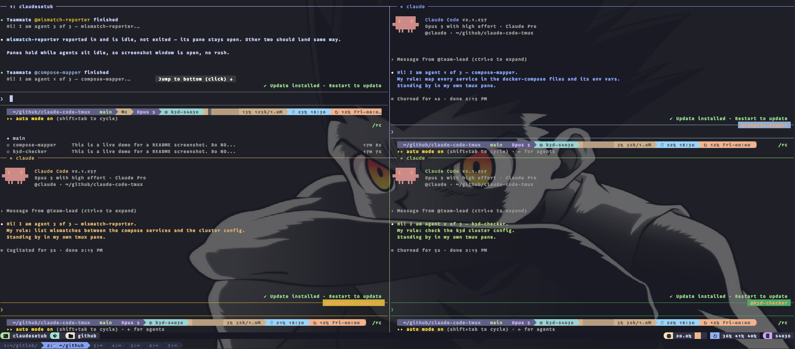

# claude-code-tmux

[](https://github.com/s403o/claude-code-tmux/actions/workflows/ci.yml)
[](LICENSE)
[](#install)
[](https://github.com/tmux/tmux)

**Watch a Claude Code agent team work side by side — one teammate per tmux pane.**



Started from inside tmux, Claude Code spawns every teammate into a real pane instead of one scrolling log. This is that setup, automated: tmux config, status bar, launcher, cleanup and a doctor command.

## Install

```bash
git clone https://github.com/s403o/claude-code-tmux.git
cd claude-code-tmux && ./install.sh    # --dry-run to preview
claude-tmux-doctor                     # verify
```

Needs tmux 3.0+, git and [Claude Code](https://claude.com/claude-code). Optional: `gitmux`, `jq`. Use a true-colour terminal with a Nerd Font — not Apple Terminal.

The installer is idempotent and backs up whatever it replaces: links the checkout to `~/.config/claude-tmux`, links `~/.tmux.conf` and the commands, clones the tmux plugins pinned, and merges the agent-team keys into `~/.claude/settings.json` without touching your existing hooks or model.

## Use

```bash
ct                    # start or attach; session named after the directory
ctc                   # clean up sessions and stray Claude processes
```

Then ask for a team in the prompt — name the count, give each agent a job it can finish alone:

```
Create a team of 3: one agent to map every service in the compose files and
its env vars, one to check the k3d cluster config, one to list mismatches
between them.
```

Three panes appear. `prefix` + `t` tiles them, `prefix` + `z` zooms one, `prefix` + `d` detaches and leaves them running.

Prefix is **Ctrl+a**. More prompts, keys and layouts: [docs/CHEATSHEET.md](docs/CHEATSHEET.md).

## What makes it work

```json
{
  "env": {
    "CLAUDE_CODE_EXPERIMENTAL_AGENT_TEAMS": "1",
    "CLAUDE_CODE_SPAWN_BACKEND": "tmux"
  },
  "teammateMode": "tmux"
}
```

Three keys in `~/.claude/settings.json`: the first turns teams on, the other two put each teammate in a pane. Agent teams are experimental, so expect these names to move — `claude-tmux-doctor` reports what your file actually says.

Everything else is ergonomics: `remain-on-exit off` so finished panes vanish, pane labels to tell agents apart, layouts on single keys.

## Commands

| Command | What it does |
| --- | --- |
| `claude-tmux` (`ct`) | Start or attach a session, run Claude Code inside it |
| `claude-tmux-cleanup` (`ctc`) | Kill sessions and stray processes. `--all`, `--force`, `--dry-run`, `--prune` |
| `claude-tmux-doctor` | Check deps, links, plugins, PATH, settings. Non-zero exit on failure |
| `./uninstall.sh` | Remove the symlinks. `--plugins --settings` to go further |
| `make check` | shellcheck + shfmt + smoke tests |

`ctc` refuses to run inside tmux, never kills the session that launched it, and ignores editor-hosted Claude processes.

Something not working? [docs/TROUBLESHOOTING.md](docs/TROUBLESHOOTING.md).

## Licence

MIT. See [LICENSE](LICENSE).
